## Project Overview

The Results Workflow project documents the end-to-end architecture and processing flows within the BLIS Results system. It covers integrations between DI instruments, Iguana channels, Kafka, backend consumers, database jobs, ETS/Ordering, Reporting, Genecys, and other downstream systems.

The project includes workflows for DI result processing, unsolicited and instrument messages, Process Order, Report Out, NonCum reporting, Result Reporting, acknowledgements, Result Completed, CHM, Audit, Reflex, Requisition Status, and Genecys integration. It also documents the migration from legacy Iguana/B2 processing to Kafka-based BLIS architecture, including configurable percentage-based routing and enablement/disablement procedures.

The documentation is intended to provide developers and support teams with a clear understanding of system components, message flows, Kafka topics, scheduled jobs, consumers, database interactions, and operational procedures used throughout the Results platform.

# Results Workflows

Technical workflow documentation for the Results/BLIS integration and processing flows.

## Table of Contents

- [DI to Result Workflow](#di-to-result-workflow)
- [Unsolicited Messages Workflow](#unsolicited-messages-workflow)
- [Instrument Messages Workflow](#instrument-messages-workflow)
- [Report Out – To Follow Workflow](#report-out-to-follow-workflow)
- [Report Out Workflow](#report-out-workflow)
- [Report Out NonCum Workflow](#report-out-noncum-workflow)
- [Process Order Workflow](#process-order-workflow)
- [Genecys Integration Workflow](#genecys-integration-workflow)
- [Result Completed Workflow](#result-completed-workflow)
- [Result Reporting Workflow](#result-reporting-workflow)
- [Report Ack Workflow](#report-ack-workflow)
- [Outbound CHM Workflow](#outbound-chm-workflow)
- [Audit Workflow](#audit-workflow)
- [Reflex Workflow](#reflex-workflow)
- [Requisition Status Workflow](#requisition-status-workflow)
- [Report Revision Workflow Document](#report-revision-workflow-document)

---

# DI to Result Workflow

## Overview

This document describes the end-to-end flow of laboratory results from
DI (Device Interface) instruments to the BLIS Result system using HL7
messaging, Iguana channels, Kafka, and backend consumers.

## Architecture Summary

- DI Instruments  
- Iguana Interface Engine (Listeners & Channels)  
- Lua Script (Processing Layer)  
- Kafka (Message Broker)  
- BLIS Result Consumer (Backend Service)  
- Audit Flow (Logging & Tracking)

## Detailed Flow

**1. HL7 Message Generation (DI Instruments)**  
Laboratory instruments generate results message in HL7 format and send
them to the interface Iguana channels.  
  
**2. Iguana Channels (Listeners)**  
On Iguana, multiple listener channels are configured to receive HL7
messages from DI instruments.

**Channel Examples:**

- DI1_BLIS

- DI2_BLIS

- DI3_BLIS

- DI4_BLIS

- … (multiple DI channels depending on instruments)

Each channel listens to a specific DI source.  
  
**3. Lua Script Processing**  
Each Iguana channel contains a **Lua script** responsible for:

- Receiving HL7 messages

- Performing percentile validation

- Forwarding the message to Kafka via Producer API as per percentile
  formula

**4. Kafka Producer**  
The Lua script sends the HL7 message to a **Kafka Producer API**, which:

- Publishes the message to a specific Kafka topic

- Ensures message delivery for downstream processing

**5. Kafka Topic**  
Kafka topics are divided into multiple segments (partitions). Messages
are distributed across these partitions, and subscribed consumers
continuously read from them. Each consumer receives and processes
messages based on its assigned partition, ensuring scalable and parallel
data processing..  
  
**6. BLIS Result Consumer**  
Within BLIS services, a **Result Consumer** is implemented.

**Responsibilities:**

- Subscribes to the Kafka topic

- Consumes incoming HL7 messages

- Parses and processes HL7 data

- Updates corresponding results in the database

**7. Result Processing**  
After consuming the message:

- HL7 segments are parsed

- The consumer identifies the **HL7 message type** (e.g., ORU, SSU)

- Based on the message type, processing is routed accordingly:

- ORU messages are forwarded to the **ORU processing flow**

- SSU messages are forwarded to the **SSU processing flow**

- Each processing flow extracts relevant result data from HL7 segments

- Extracted values are validated and mapped to the database schema

- Database records are updated accordingly

**8. Audit Flow**  
In parallel with result processing, an **Audit Flow** is executed:

- Tracks processing steps

- Logs important events

- Inserts audit records into audit tables

This ensures traceability and debugging capability.

Below is the flowchart illustrating the end-to-end data flow from DI
instruments to BLIS:  
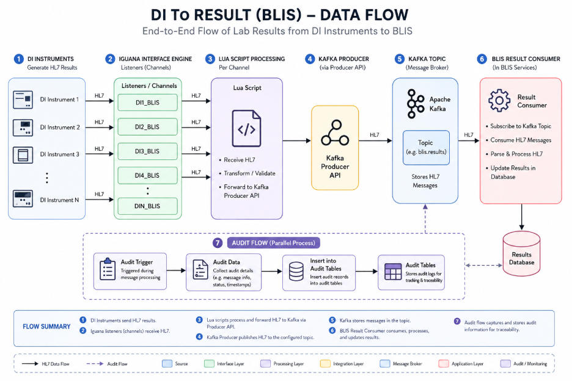

# Unsolicited Messages Workflow

## **Overview**

This document explains the workflow for handling **Unsolicited HL7
Messages** in the Results Processing System. The workflow is designed to
manage scenarios where an HL7 result message is received before the
corresponding order exists in the system.

The process ensures that:

- Incoming HL7 result messages are not lost.

- Missing orders are requested automatically from ETS/Ordering services.

- Once the order is created, the original HL7 message is reprocessed
  successfully.

## Workflow Description

## **1. HL7 Message Received from DI Channel**

The workflow starts when an HL7 message is received through the **DI
Channel** into the **Results Consumer Service**.

The consumer extracts the **Accession Number** from the incoming HL7
message and attempts to locate the corresponding order/results record in
the database.

## **2. Accession Number Not Found**

If the accession number does not exist in the database:

- The Results Consumer cannot process the HL7 normally.

- Instead of rejecting or losing the message, the system stores the HL7
  in the **Unsolicited Messages Table**.

The following information is stored:

- Original HL7 Message

- Accession Number

- Created Date/Time

- Process Date

- Send To ETS Date

- Expire Date

This allows the message to remain available for future reprocessing.

## **3. Unsolicited Messages Scheduled Job Executes**

A background job runs periodically.

The responsibility of this job is to:

1.  Read pending records from the **Unsolicited Messages Table**

2.  Extract the accession number

3.  Send the accession information to the **Send to ETS API**

URL:

/orders/ets/CreateManifestsWithDOS.ashx?un=b2reflexestospm&payload=8127929&callingapplication=b2

## **4. Send To ETS API Processing**

The **Send To ETS API** forwards the accession/order request to the ETS
Ordering Services.

The ETS/Ordering team services then attempt to locate and generate the
missing order.

Once identified, the ordering system sends the order through one of the
following channels:

- Iguana Channel

- BLIS Channel

These channels publish the order using the **Process Order** workflow.

## **5. Order Creation**

When the Process Order workflow executes:

- The order is created successfully in the database.

- The accession number now becomes available in the Results system.

At this stage, the system is ready to process the previously stored HL7
result message.

## **6. Reprocessing the Original HL7 Message**

During order creation processing:

1.  The system retrieves the original HL7 message from the **Unsolicited
    Messages Table**

2.  The HL7 message is published again to the **Results Kafka Topic**

## **7. Result Consumer Kafka Processes HL7**

The Results Kafka Consumer picks up the HL7 message again.

Since the order now exists:

- All HL7 result processing succeeds normally.

- Result service execute successfully.

- Any required result modifications, updates, mappings, and database
  operations are completed.

The unsolicited message entry can then be marked as:

- Processed Completed

**End-to-End Flow Summary**  
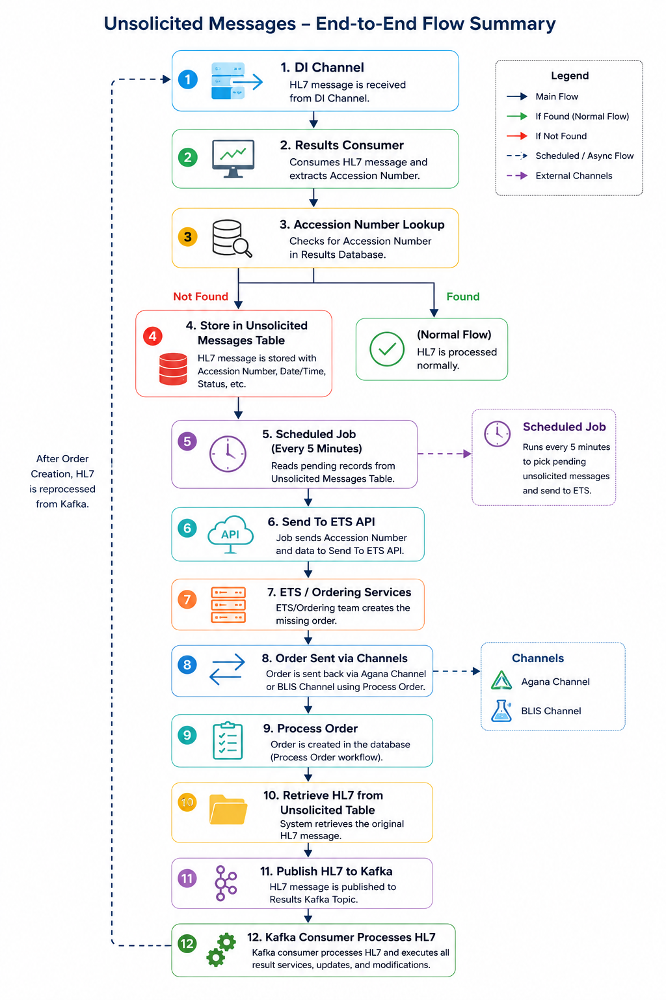

# Instrument Messages Workflow

## **Overview**

This document explains the workflow for handling **Instrument Messages**
in the Results Processing System.

The Instrument Message workflow is very similar to the Unsolicited
Messages workflow, with one key difference:

- Instead of storing the complete HL7 message for later result
  processing,

- The system stores only the **Instrument Load Time** information for
  analytes.

This workflow is used when the incoming HL7 message contains an **SSU
message type**, indicating that the message represents instrument
loading information rather than final results.

## **1. HL7 Message Received from DI Channel**

The workflow begins when an HL7 message is received from the **DI
Channel** into the **Results Consumer Service**.

The consumer reads the incoming HL7 message and checks the message type
section.

## **2. STS Value Detected**

If the HL7 message contains:

STS

Inside the message type, the system identifies the message as an
**Instrument Message**.

This means:

- The message contains instrument-related load time information.

- The actual order may not yet exist in the database.

- Result processing should not occur yet.

## **3. Save Data into Instrument Table**

Unlike the Unsolicited workflow:

- The HL7 message is NOT stored in the Unsolicited Messages Table.

- Instead, the system extracts the **Instrument Load Time** information.

The following information is stored in the **Instrument Table**:

- Accession Number

- Analyte Information

- Instrument Load Time

- Created Date/Time

- Processing Date

- Send to ETS Date

The full HL7 payload is typically not required here because only
timing-related information is needed later.

## **4. Instrument Scheduled Job Executes**

A separate scheduled background job runs periodically for Instrument
Messages.

The job:

1.  Reads pending entries from the Instrument Table

2.  Extracts the accession/order information

3.  Sends the request to the **Send To ETS API**

This happens because the order still does not exist in the system.

## **5. Send To ETS API Processing**

The Send To ETS API forwards the accession/order request to the ETS
Ordering Services.

The ETS/Ordering Services then:

- Locate or generate the missing order

- Send the order through:

  - Iguana Channel

  - BLIS Channel

The order then enters the standard **Process Order Workflow**.

## **7. Instrument Data Retrieved**

If matching records exist in the Instrument Table:

- The system retrieves the stored Instrument Load Time information.

- The analyte-level load time values are extracted.

Unlike the Unsolicited workflow:

- No HL7 republishing to Kafka occurs.

- No result reprocessing occurs.

Only instrument-related timing information is applied.

## **8. Update Analyte Instrument Load Times**

The Process Order workflow updates the analytes with the retrieved
Instrument Load Time values.

The load time is attached against the relevant analytes/order records in
the database.

This completes the Instrument Message workflow.

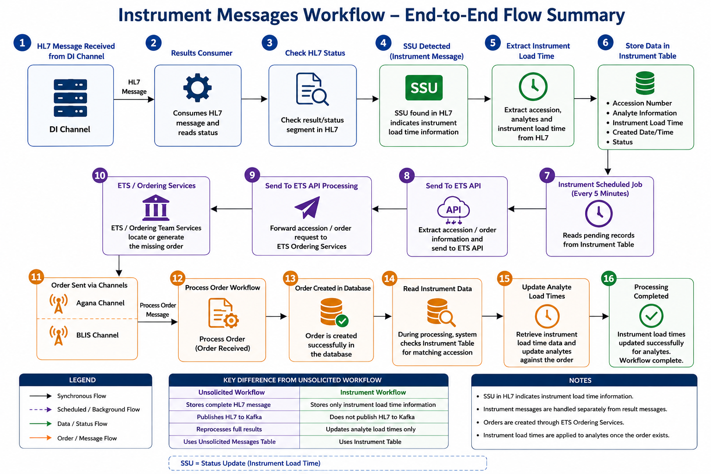

# Report Out – To Follow Workflow

## **Overview**

The Report Out To-Follow Workflow is used when an order is being
created, and the system needs to immediately send report/analyte
information to the reporting system with the SendToFollow flag enabled.

## **Workflow Description**

### **1. Order Creation Starts**

When an order comes into the system for creation, the order processing
flow starts.

During this process, the system prepares outbound reporting entries.

### **2. Entry Added to OutboundOrderQueue**

During order creation, entries are inserted into:

OutboundOrderQueue

In this table, a column exists called:

SendToFollow

For this workflow, the value is set as:

SendToFollow = True

### **3. Report Out Consumer Processing**

The Report Out Consumer checks records where:

SendToFollow = True

For those records, the consumer fetches all analytes related to the
report/order.

### **4. Send Report to Reporting**

If SendToFollow = True, then all report analytes are sent to the
reporting system.

The consumer prepares the report data and sends it forward for
reporting.

# Report Out Workflow

## **Overview**

This document explains the **Report Out Workflow** used for sending
released analytes for a report to external reporting systems from **B2**
and **BLIS** after getting results from the DI channels.  
**1. Report Release**

Whenever a report is released:

- All analytes status changes to **Released**

- After release, the status is updated to:

SentToReporting

This indicates that the report is ready for outbound reporting
processing.

The workflow begins when all analytes within a report are released. Once
released, the system queues the report for outbound processing and
distributes reports between B2 and BLIS systems based on configurable
percentage rules.

## 2. OutboundOrderQueue Table Structure

The queue table contains the following information:

| **Field**       | **Description**                        |
|-----------------|----------------------------------------|
| OrderId         | Internal Order Identifier              |
| AccessionNumber | Accession Number                       |
| ReleaseDate     | Date/Time when released                |
| IsReportable    | Indicates whether report is reportable |
| ReportId        | Report Identifier                      |
| SentToFlow      | Flow destination tracking              |

## **3. Report Out Job Execution**

A background job called:

ReportOutJob

runs at a scheduled interval.

The responsibility of this job is to:

- Fetch pending outbound records

- Process report distribution

- Push data into Kafka for downstream processing

## **4. Stored Procedure Execution**

The Report Out Job executes the stored procedure:

LIS_Reports_Outbound_Fetch

This stored procedure is responsible for:

- Fetching pending outbound reports

- Applying BLIS/B2 routing logic

- Applying percentage-based traffic distribution

## BLIS vs B2 Routing

Currently, the system supports two outbound systems:

| **System** | **Description**         |
|------------|-------------------------|
| B2         | Legacy reporting system |
| BLIS       | New reporting system    |

When processing outbound reports:

- An additional parameter called:

IsBlis

is passed into the stored procedure.

Values:

- IsBlis = True → Send to BLIS

- IsBlis = False → Send to B2

## Percentage-Based Routing Logic

Inside the stored procedure:

LIS_Reports_Outbound_Fetch

a percentage-based routing mechanism is implemented.

The percentage value is read from application settings.

## **Settings Variable**

The setting used is:

Blis_Percentile_ReportOutbound

This setting determines how much traffic should go to BLIS vs B2.

## Example Routing Behavior

## **Example 1 — 50 Percent BLIS Routing**

If:

Blis_Percentile_ReportOutbound = 50

and there are:

10 records

in the queue table:

Then:

- 5 reports are sent to BLIS

- 5 reports are sent to B2

## **Example 2 — 100 Percent BLIS Routing**

If:

Blis_Percentile_ReportOutbound = 100

Then:

- All reports are sent to BLIS

- No reports are sent to B2

## **Example 3 — 0 Percent BLIS Routing**

If:

Blis_Percentile_ReportOutbound = 0

Then:

- All reports are sent to legacy B2

- No reports are sent to BLIS

**5. Data Retrieved by Report Out Job**

The Report Out Job fetches the following data from the queue:

| **Field**       | **Description**     |
|-----------------|---------------------|
| AccessionNumber | Report accession    |
| IsReportable    | Reportable flag     |
| ReleaseDate     | Report release date |
| ReportId        | Report identifier   |

## **6. Kafka Report Out Processing**

After the Report Out Job retrieves all eligible outbound records from
the database, the job publishes the data to the Kafka topic.

The Kafka topic used for outbound reporting is:

Results.rep-result.generated

The Report Out Job sends the following information to the Kafka topic:

## **7. Report Out Kafka Consumer**

A dedicated Kafka consumer called:

Report Out Consumer

listens to the Kafka topic:

Results.rep-result.generated

## **Report Out Consumer Responsibilities**

The Report Out Consumer performs the following steps:

### **Step 1 — Consume Kafka Message**

The consumer fetches the outbound reporting message from the Kafka
topic.

### **Step 2 — Fetch Report Data**

Using the:

ReportId

The consumer retrieves complete report data from the database.

### **Step 3 — Generate HL7 Message**

After fetching the required report information, the consumer generates
an HL7 message by using HL7 parser tool.

### **Step 4 — Send HL7 to Reporting System**

Once the HL7 message is generated:

- The Report Out Consumer sends the HL7 message to the Reporting System.

- Depending on routing configuration, the message may be delivered by:

  - BLIS

  - B2

# Report Out NonCum Workflow

## **Overview**

This document explains the workflow for:

ReportOut Noncum

This workflow is specifically designed for analytes that contain
allergen-related processing requirements.

During the normal Report Out process, certain analytes are separated
from the standard reporting flow and routed through a dedicated NonCum
reporting pipeline.

## Workflow Description

## **1. HL7 Generation During Report Out**

During the normal Report Out workflow:

- The Report Out Consumer fetches report data

- Generates HL7 messages analyte-wise

- Processes analytes individually before sending to reporting systems

## **2. Allergen Check**

While processing analytes, the consumer checks a variable called:

HasAllergen

for each analyte based on the Category as “allergen".

## HasAllergen Logic

| **Condition**       | **Action**                            |
|---------------------|---------------------------------------|
| HasAllergen = False | Continue normal Report Out processing |
| HasAllergen = True  | Move Report to Report Out NonCum flow |

## **3. Insert into Outbound Allergen Queue**

If:

HasAllergen = True

then the analyte is NOT processed through the normal Report Out flow.

Instead:

- An entry is inserted into a dedicated table called:

> OutboundAllergenQueueItem

## **4. Excluded from Normal Report Out**

Once the analyte is inserted into:

OutboundAllergenQueueItem

the analyte is skipped from the normal Report Out process.

This ensures:

- Allergen-related analytes are processed separately

- Dedicated handling rules can be applied

- Specialized reporting workflows remain isolated

## **5. Report Out NonCum Job**

A dedicated scheduled job exists for:

Report Out NonCum

The job periodically:

- Reads pending entries from:

OutboundAllergenQueueItem

- Fetches queued allergen report items

- Sends them for downstream processing

## **6. Report Out NonCum Consumer**

A dedicated consumer called:

ReportOutNonCum Consumer

processes the queued allergen records.

## Consumer Responsibilities

## **Step 1 — Fetch Queue Data**

The consumer retrieves pending allergen queue records.

## **Step 2 — Fetch Report Data from Database**

Using the:

ReportId

The consumer retrieves complete report and analyte information from the
database.

## **Step 3 — Generate HL7**

The consumer generates an HL7 message

## **Step 4 — Send to Reporting System**

After HL7 generation:

- The HL7 message is sent to the reporting system.

- The message is processed by the dedicated NonCum to reporting flow.

## **Prerelease Notes for Report Out and Non Cum**

#### **1. Channel Configuration**

- **Channel Name:** O.R.BLIS.REP

- **Endpoint URL:** <http://nj1iguanaq04:6544/ResultsToReporting>

**Note:** Maintain a minimum of **one Iguana channel for 4K accessions**
to ensure processing, even when **100% of the volume is sourced from
BLIS**.

#### **2. Deployment Configuration**

- Apply all required deployment configuration changes.

- Verify environment-specific settings prior to deployment.

#### **3. Database Changes**

- Deploy all approved stored procedure (SP) changes.

#### **4. Kafka Setup**

- Configure and start the required Kafka consumers.

- Validate consumer connectivity and message processing before release.

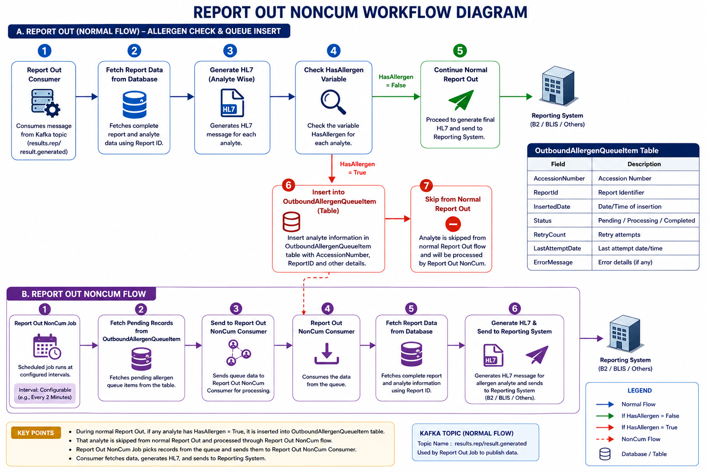

# Process Order Workflow

## **Overview**

The **Process Order Workflow** is responsible for receiving newly
created orders from the Ordering System and creating them inside the
Results System.

Orders may originate from:

- SPM BLIS

- Legacy SPM

- Other Ordering Sources

The workflow uses Kafka for communication between the Ordering System
and the Results System.

## Workflow Description

## **1. Order Creation in Ordering System**

When a new accession/order is created in:

- SPM BLIS

- Legacy SPM

- Other Ordering Applications

the order information is inserted into the Ordering database queue
table.

QueueOrder

## **2. Ordering Job Picks Up Queue Records**

The Ordering Team has a background job that continuously monitors:

QueueOrder

When a new record is found:

- The job retrieves the order information.

- Prepares the outbound order message.

### **Important Note – Order Routing and Distribution Control**

**Note:** After an order is inserted into the **QueueOrder** table and
picked up by the Ordering Job, the Ordering System determines how the
order will be distributed downstream.

The Ordering Team maintains a configuration variable:

- Processed Date

Based on this configuration, the Ordering Job can route orders through
one of two integration paths.

### **Option 1 – Kafka-Based Processing (New Architecture)**

QueueOrder  
↓  
Ordering Job  
↓  
Kafka Topic  
(orders.order-message.generated)  
↓  
Results Process Order Consumer  
↓  
OrderController.ProcessMessage  
↓  
Results System

### **Option 2 – Iguana-Based Processing (Legacy Architecture)**

QueueOrder  
↓  
Ordering Job  
↓  
Iguana Interface  
↓  
Legacy Order Processing Flow  
↓  
Results System (B2)

### **Purpose**

This routing mechanism allows the Ordering Team to control whether
orders are sent through:

- **Kafka (new messaging architecture)**, or

- **Iguana (legacy integration platform)**

The decision is controlled entirely by the Ordering System configuration
and can be adjusted without requiring any changes to the Results System.

## **3. Publish Order to Kafka**

The Ordering Job publishes the order message to Kafka.

Kafka Topic:

orders.order-message.generated

This topic is used to distribute newly created orders to downstream
systems.

## **4. Process Order Consumer Listens to Kafka**

Inside the Results System, a Kafka Consumer exists called:

Process Order Consumer

This consumer continuously listens to:

orders.order-message.generated

As soon as a new order message arrives, the consumer retrieves the
order's payload.

## **5. Call ProcessMessage API**

Instead of directly processing the order, the consumer calls an internal
Results API.

API:

POST /Order/ProcessMessage

Location:

OrderController

The Kafka message is forwarded to this API for processing.

## **6. ProcessMessage API Processing**

The ProcessMessage API receives the order request and determines how the
order should be processed.

The decision is based on:

CallingApplication

contained within the order object.

## Decision Point

## **CallingApplication = NextGen**

If:

CallingApplication = NextGen

The request follows the NextGen processing path.

### **NextGen Processing**

For NextGen orders:

- The order is not fully processed.

- Only the EUID information is updated.

Actions:

Update EUID  
↓  
Complete Processing

No new order creation occurs inside Results.

## **CallingApplication ≠ NextGen**

If the CallingApplication is not NextGen:

CallingApplication != NextGen

the request is routed to:

ProcessQueueItem

## **7. ProcessQueueItem Processing**

The ProcessQueueItem method performs full order creation within the
Results System.

Responsibilities include:

### **Create Order**

- Create accession/order record.

### **Create Order Lines**

- Create all order lines.

### **Create Analytes**

- Create analytes associated with the order.

Essentially, this method builds the complete order structure required by
the Results System.

## **Important Note – Unsolicited Result Reprocessing**

**Note:** After an order is successfully created in the Results System
through the **ProcessQueueItem** workflow, the system performs an
additional check against the **Unsolicited Messages** table.

The purpose of this check is to determine whether any previously
received HL7 result messages were stored because the accession did not
exist at the time the result was received so it send a request to ETS.

### **Processing Steps**

1.  After the accession/order is created in Results, the system searches
    the **Unsolicited Messages** table.

2.  If no matching record exists, processing completes normally.

3.  If a matching unsolicited record is found, the system retrieves the
    stored HL7 message containing the result data.

4.  The stored HL7 message is then republished to the Kafka topic:

results.di-result.received

5.  This topic is monitored by the Result Consumer.

6.  The Results Consumer processes the HL7 message again and applies all
    results, updates, and modifications to the newly created accession.

## BLIS Process Order Enablement / Disablement Control

## Overview

To support the migration from the legacy B2 processing flow to the
BLIS/Kafka-based architecture, a configuration-driven mechanism was
introduced to control whether the Results System processes incoming
Process Order messages.

This functionality allows operations teams to safely enable, disable,
and validate Process Order for processing without requiring code
deployments.

## Components Introduced

The following components were introduced as part of the BLIS Process
Order implementation:

### Database Components

**Stored Procedure**

lis_Queue_B2_Fetch_By_Id

Used to retrieve and process queued order records for BLIS-enabled order
processing.

### Application Settings

**EnableProcessOrderConsumer**

Default Value = False

This setting controls whether the Process Order Consumer actively
processes incoming Kafka messages.

When:

EnableProcessOrderConsumer = True

the consumer processes incoming orders.

When:

EnableProcessOrderConsumer = False

the consumer continues consuming messages but does not process them.

### Consumer

consumer.results.order-processor

Responsible for consuming Process Order messages from:

orders.order-message.generated

and creating orders within the Results System.

## First-Time Enablement Procedure

The following steps should be performed during the initial activation of
BLIS Process Order processing.

### Step 1 – Clean Kafka Topic

Perform a one-time cleanup of the Kafka topic:

orders.order-message.generated

This ensures no historical messages are unintentionally processed.

### Step 2 – Enable Process Order Consumer

Update the application setting:

EnableProcessOrderConsumer = True

### Step 3 – Restart Result Consumer

Restart:

consumer.results.order-processor

to load the updated configuration.

### Step 4 – Update SPM Rule

Update the following SPM configuration:

BLISPendingStatus_B2 = 6  
IsDeleted = 0

Status **6** indicates that orders should be routed through the
BLIS/Kafka Process Order workflow.

### Step 5 – Restart Order Service

Restart the Order Service POD so the updated SPM configuration is
refreshed.

## Regular Enablement Procedure

For subsequent enablement activities, perform the following steps:

### 1. Enable Consumer Processing

EnableProcessOrderConsumer = True

### 2. Restart Process Order Consumer

consumer.results.order-processor

### 3. Update SPM Rule

BLISPendingStatus_B2 = 6  
IsDeleted = 0

### 4. Restart Order Service

Restart:

service.orders.order-api

or the associated Order Service POD.

### Result

The Process Order Consumer will begin processing incoming Kafka messages
and creating orders in the Results System.

## Disablement Procedure

If Process Order processing needs to be disabled, perform the following
steps.

### Step 1 – Stop New BLIS Messages

Update the SPM rule:

BLISPendingStatus_B2 = 1  
IsDeleted = 0

This prevents new orders from being routed into the BLIS/Kafka
processing flow.

### Step 2 – Restart Order Service

Restart:

service.orders.order-api

to refresh the updated SPM configuration.

### Step 3 – Allow Existing Messages to Complete

Verify that the Process Order Consumer has completed processing any
remaining:

Status 6

messages already present in the queue.

This prevents partial processing or message loss.

### Step 4 – Disable Consumer Processing

Update the application setting:

EnableProcessOrderConsumer = False

### Step 5 – Restart Process Order Consumer

Restart:

consumer.results.order-processor

### Result

The consumer will continue listening to Kafka messages, but it will not
process or create orders while the flag remains disabled.

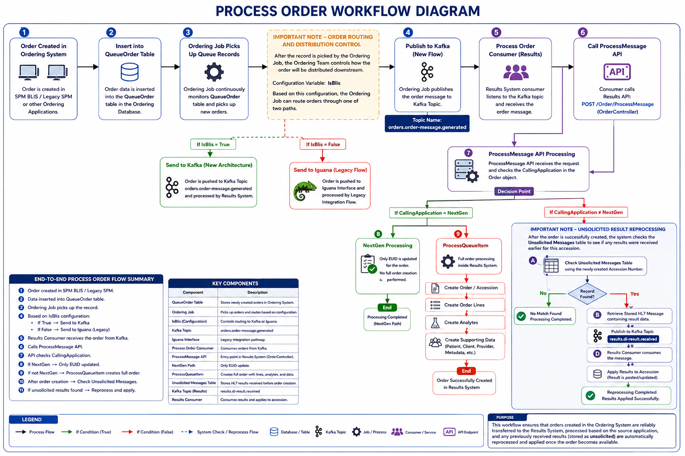

# Genecys Integration Workflow

## Overview

**Genecys** is a Women's Health application where women's health testing
orders are created and managed.

The integration between **Genecys** and **BLIS** consists of two
independent workflows:

1.  **Orders Flow** – Orders created in Genecys are sent to B2/BLIS.

2.  **Results Flow** – Results released in B2/BLIS are sent back to
    Genecys.

The integration supports both the new BLIS architecture and the legacy
of Iguana architecture through a configurable percentage-based routing
mechanism.

## Workflow 1 – Orders From Genecys to BLIS

## Overview

This workflow is responsible for creating orders in B2/BLIS when orders
are created in Genecys.

## 1. Order Created in Genecys

When a Women's Health order is created in Genecys, the order becomes
eligible for outbound processing.

## 2. Genecys Producer Job Executes

A scheduled job runs on the Genecys side:

job.genecys.molecular-order-message-producer

The job identifies new molecular orders and prepares them for
transmission.

## 3. Percentage-Based Routing

Before transmitting the order, Genecys applies for a percentage-based
routing configuration.

This routing determines:

- How many orders are sent through the new BLIS integration.

- How many orders continue through the legacy Iguana integration.

### Example

If the configured percentage is:

50%

Then:

- 50% of orders are routed through BLIS.

- 50% of orders are routed through Iguana.

This percentage can be increased or decreased during rollout.

## 4. Send Order to BLIS

For orders selected for BLIS processing, the job sends the order message
to:

consumer.results.molecular-order-receiver

## 5. Order Creation in B2/BLIS

The consumer receives the order information and creates the
corresponding order inside the Results/B2 system.

## Orders Flow Summary

Order Created in Genecys  
↓  
job.Genecys.molecular-order-message-producer  
↓  
Apply Percentage Routing  
↓  
BLIS  
↓  
consumer.results.molecular-order-receiver  
↓  
Create Order in B2/BLIS

## Workflow 2 – Results From BLIS to Genecys

## Overview

This workflow sends released molecular test results from BLIS Results
back to Genecys.

## 1. Result Released in BLIS

A result becomes eligible for transmission when:

ExternalAppId = 5  
Status = Released

## 2. Result Producer Job Executes

A scheduled job runs on the BLIS side:

job.results.molecular-result-producer

The job retrieves all eligible for released molecular results.

## 3. Percentage-Based Routing

Before sending results, the job applies to a percentage-based routing
configuration from SP.

This allows the organization to control:

- What percentage of results are sent through the BLIS integration.

- What percentage continue through the legacy Iguana integration.

### Example

If configured at:

75%

Then:

- 75% of results are transmitted through BLIS.

- 25% continue through Iguana.

## 4. Send Results to Genecys

The BLIS job publishes the result message to the Genecys consumer:

consumer.Genecys.molecular-result-receiver

## 5. Result Applied in Genecys

The Genecys consumer receives the message and applies the released
molecular result to the corresponding Genecys order.

## Results Flow Summary

Result Released in B2/BLIS  
(AppId = 5, Status = Released)  
↓  
job.results.molecular-result-producer  
↓  
Apply Percentage Routing  
↓  
BLIS or Iguana  
↓  
consumer.Genecys.molecular-result-receiver  
↓  
Apply Result in Genecys

## Important Notes

### Percentage-Based Migration

Both the Order Flow and Result Flow support percentage-based routing.

This allows operations teams to:

- Gradually migrate traffic from Iguana to BLIS.

- Control rollout without code changes.

- Quickly rollback if issues occur.

- Validate integrations in production using a controlled percentage of
  traffic.

### No 4K Processing Path

There is no 4K processing path in the Genecys integration workflow.

## End-to-End Architecture

ORDERS FLOW  
  
Genecys  
↓  
job.Genecys.molecular-order-message-producer  
↓  
Percentage Routing  
↓  
consumer.results.molecular-order-receiver  
↓  
B2 / BLIS  
  
  
RESULTS FLOW  
  
B2 / BLIS  
↓  
job.results.molecular-result-producer  
↓  
Percentage Routing  
↓  
consumer.Genecys.molecular-result-receiver  
↓  
Genecys

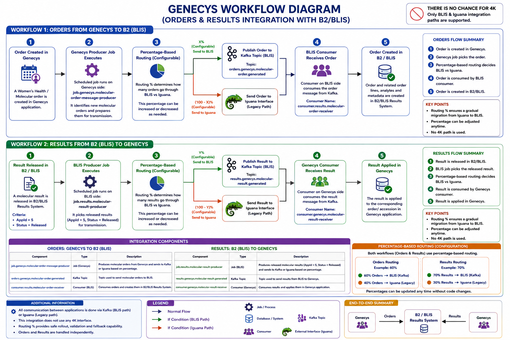

# Result Completed Workflow

## Overview

The **Result Completed Workflow** handles completion/status messages
coming from the Reporting side into the BLIS Results system on accession
level.

In this flow, Reporting sends a message through the inbound reporting
channel. The message is then forwarded to a Kafka topic, where the
Results system consumes it and updates the accession status in the
database.

## Workflow Description

## 1. Message Originates from Result Completed

The flow starts from:

Result-Reporting

The message moves through:

Reporting

and then into:

I.R.REP.B2

The message format is text.

## 2. Inbound Reporting Channel

The inbound channel used for this workflow is:

I.S.REP.BLIS-CHM.1

## 3. Source Component

The source feeding this channel is:

I.S.REP.B2-CHM.1 COM

This source receives the inbound reporting message.

## 4. Lua Script Processing

After the message is received by the channel, a Lua script processes the
message.

The Lua script is responsible for forwarding the message to Kafka.

## 5. Publish Message to Kafka Topic

The Lua script sends the message to the Kafka topic:

results.rep-comp-status.received

## 6. ResultCompleted Consumer

A consumer named:

ResultCompleted Consumer

listens to the topic:

results.rep-comp-status.received

The consumer reads and processes the incoming message.

## Message Data

The consumed message contains the following key fields:

| **Field**       | **Description**                 |
|-----------------|---------------------------------|
| AccessionNumber | Accession number for the report |
| Status          | Reporting completion status     |
| FinalReportDate | Final report date               |
| ServiceDate     | Service date                    |

## 7. Database Status Update

After consuming the message, the **ResultCompleted Consumer**:

1.  Extracts the accession number.

2.  Looks up the matching accession in the database.

3.  Updates the accession/report status.

4.  Updates final report date and service date where applicable.

## End-to-End Flow Summary

Reporting

↓

I.R.REP.B2

↓

Channel: I.S.REP.BLIS-CHM.1

↓

Source: I.S.REP.B2-CHM.1 COM

↓

Lua Script

↓

Kafka Topic:

results.rep-comp-status.received

↓

ResultCompleted Consumer

↓

Extract AccessionNumber, Status,

FinalReportDate, ServiceDate

↓

Update Accession/Report Status

in BLIS Results Database

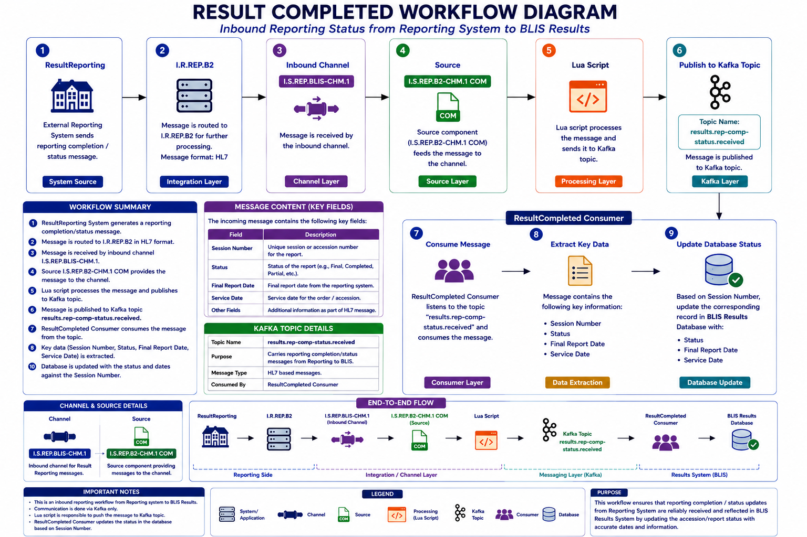

# Result Reporting Workflow

## Overview

The **Result Reporting Workflow** handles inbound HL7 result messages
coming from the Reporting system into BLIS Results.

The message is received through an Iguana channel, forwarded to Kafka
through a Lua script, consumed by the **ResultReporting Consumer**,
parsed as HL7, decoded using ORU mapping, and then forwarded to
**ProcessORUMessage** for further result processing.

## 1. Message Comes from Reporting

Reporting sends HL7 data to BLIS Results.

Reporting  
↓  
BLIS Results

The inbound message format is:

HL7

## 2. Iguana Channel

The Iguana channel used for this workflow is:

I.R.REP.BLIS.1.1

## 3. Channel Source

The source feeding the channel is:

I.R.REP.B2.1 COM

This source receives the HL7 message from Reporting.

## 4. Lua Script Sends Message to Kafka

The channel has a Lua script configured on the destination side.

The Lua script sends the received HL7 message to the Kafka topic:

results.rep-result-status.received

## 5. ResultReporting Consumer

A consumer named:

ResultReporting Consumer

listens to the Kafka topic:

results.rep-result-status.received

The consumer receives the HL7 message and starts result processing.

## 6. HL7 Parsing

Inside the ResultReporting Consumer:

1.  The HL7 message is received.

2.  The HL7 Parser Tool decodes the message.

3.  The message is mapped using ORU mapping.

4.  An ORU object is created.

5.  The object is forwarded to:

ProcessORUMessage

## 7. ProcessORUMessage

ProcessORUMessage fetches the report and then processes it based on the
receiving application.

At this stage, the workflow checks the receiving app and routes the
message accordingly.

Example:

If ReceivingApp = B2-4K  
→ Send to B24K processing

If ReceivingApp = B2-QNS  
→ Send to Process Hospital QNS Message processing

Then → Send to Micropath Message processing

## End-to-End Flow Summary

Reporting  
↓  
HL7 Message  
↓  
Iguana Channel  
I.R.REP.BLIS.1.1  
↓  
Source  
I.R.REP.B2.1 COM  
↓  
Lua Script  
↓  
Kafka Topic  
results.rep-result-status.received  
↓  
ResultReporting Consumer  
↓  
HL7 Parser Tool  
↓  
ORU Mapping  
↓  
Create ORU Object  
↓  
ProcessORUMessage  
↓  
Fetch Report  
↓  
Route by Receiving Application  
↓  
Process Result in BLIS Results

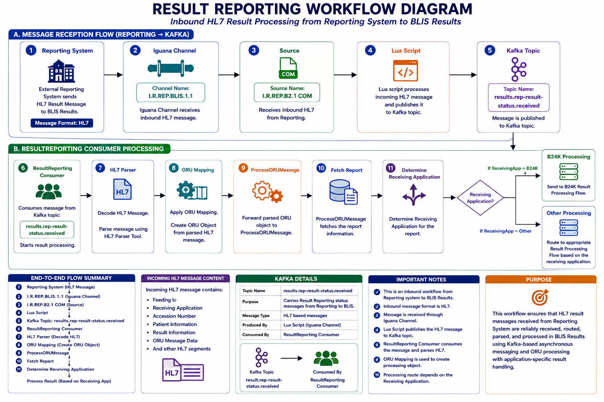

# Report Ack Workflow

## Overview

The **Report Ack Workflow** handles inbound acknowledgement messages
coming from the Reporting system back to BLIS Results.

In this flow, Reporting sends an HL7 acknowledgement message. The
message is received through an Iguana channel, forwarded to Kafka using
a Lua script, and then consumed by the **ResultAck Consumer** for
acknowledgement processing.

## Workflow Description

### 1. Acknowledgement Comes from Reporting

Reporting sends an acknowledgement message back to B2/BLIS Results.

The message format is:

HL7

The message type is:

MessageType.FUNC_ACK

### 2. Iguana Channel

The channel used for this workflow is:

I.S.REP.BLIS.1

### 3. Source Queue

The source feeding this channel is:

I.S.REP.B2.1 Queue

This queue receives acknowledgement messages from Reporting.

### 4. Lua Script Sends Message to Kafka

A Lua script is configured after the source.

The Lua script publishes the incoming acknowledgement message to Kafka
topic:

results.rep-ack.received

### 5. ResultAck Consumer

The Kafka topic is consumed by:

ResultAck Consumer

The consumer receives the HL7 acknowledgement message and starts
processing.

## Consumer Processing

### 6. HL7 Parser Tool

Inside the ResultAck Consumer:

1.  HL7 acknowledgement message is received.

2.  Message is decoded using the HL7 Parser Tool.

3.  Since the message type is FUNC_ACK, the message is decoded using:

ON STS / STS Mapping

### 7. Create STS Object

After parsing, the consumer creates an STS-based acknowledgement object
from the HL7 message.

### 8. Forward to Inbound Processor

The created object is forwarded to the inbound processor method:

OnSTSMessage

### 9. Acknowledgement Processing

OnSTSMessage processes the acknowledgement and performs the required
status/update logic inside the Results system.

## End-to-End Flow Summary

Reporting  
↓  
HL7 Acknowledgement Message  
(MessageType.FUNC_ACK)  
↓  
Iguana Channel  
I.S.REP.BLIS.1  
↓  
Source Queue  
I.S.REP.B2.1 Queue  
↓  
Lua Script  
↓  
Kafka Topic  
results.rep-ack.received  
↓  
ResultAck Consumer  
↓  
HL7 Parser Tool  
↓  
STS Mapping / ON STS  
↓  
Create STS Object  
↓  
Inbound Processor  
OnSTSMessage  
↓  
Process Acknowledgement  
↓  
Update Ack/Status in Results System

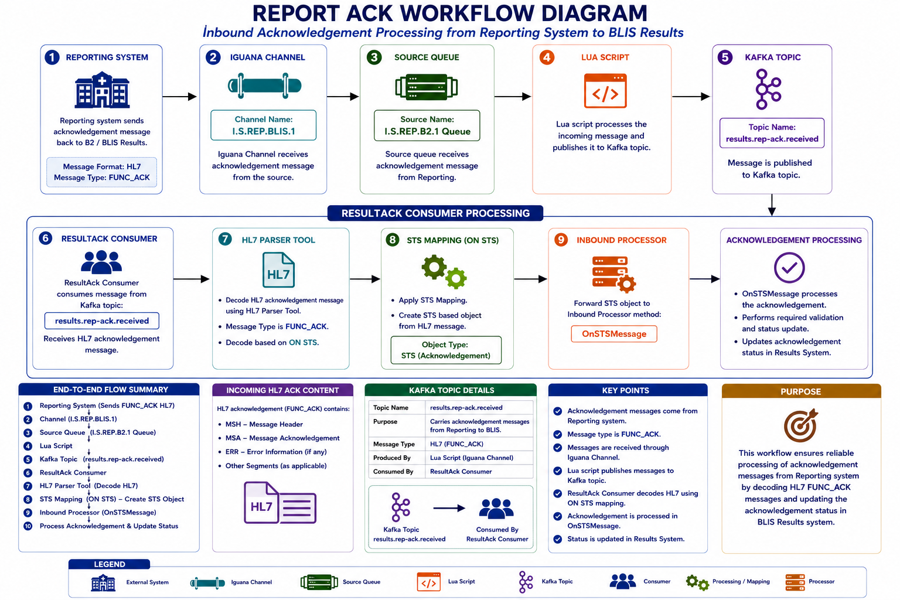

# Outbound CHM Workflow

## Overview

The **Outbound CHM Workflow** sends CHM data from BLIS Results to the
CHM system.

This workflow has two main parts:

1.  **Outbound CHM Job** — fetches data from the database and publishes
    it to Kafka.

2.  **Outbound CHM Consumer** — consumes Kafka messages and sends them
    to Iguana through HTTP.

## Workflow Description

### 1. Outbound CHM Job Runs

A scheduled job runs at configured time intervals.

Job:

OutboundCHMJob

The job fetches eligible outbound CHM records from the database.

### 2. Stored Procedure Execution

The job runs the stored procedure:

lis_OutboundMessageCHM_Fetch

This stored procedure returns the CHM outbound data that needs to be
sent.

### 3. Publish Message to Kafka

After fetching the data, the job publishes the message to Kafka topic:

results.chm-status.generated

### 4. Outbound CHM Consumer

The Kafka topic is consumed by:

OutboundCHM Consumer

The consumer receives the CHM message from Kafka.

### 5. Send Data to Iguana Over HTTP/HTTPS

The consumer sends the data to the Iguana HTTP/HTTPS endpoint:

<http://nj1iguanaq04:6544/outboundchm>

### 6. Iguana Channel Receives Message

The Iguana channel receiving this message is:

O.R.BLIS.CHM.1

Source:

HTTPS

This channel receives the outbound CHM message from the consumer.

### 7. Forward to B2 CHM Channel

After receiving the message, the Iguana channel forwards it to:

O.R.B2.CHM.1 COM

### 8. Send to CHM

The O.R.B2.CHM.1 COM component sends the data onward to CHM.

## End-to-End Flow Summary

OutboundCHMJob  
↓  
Fetch Data from Database  
↓  
Run Stored Procedure  
lis_OutboundMessageCHM_Fetch  
↓  
Publish to Kafka Topic  
results.chm-status.generated  
↓  
OutboundCHM Consumer  
↓  
Send data over HTTP/HTTPS  
<http://nj1iguanaq04:6544/outboundchm>  
↓  
Iguana Channel  
O.R.BLIS.CHM.1  
↓  
Source: HTTPS  
↓  
Forward to  
O.R.B2.CHM.1 COM  
↓  
Send Data to CHM

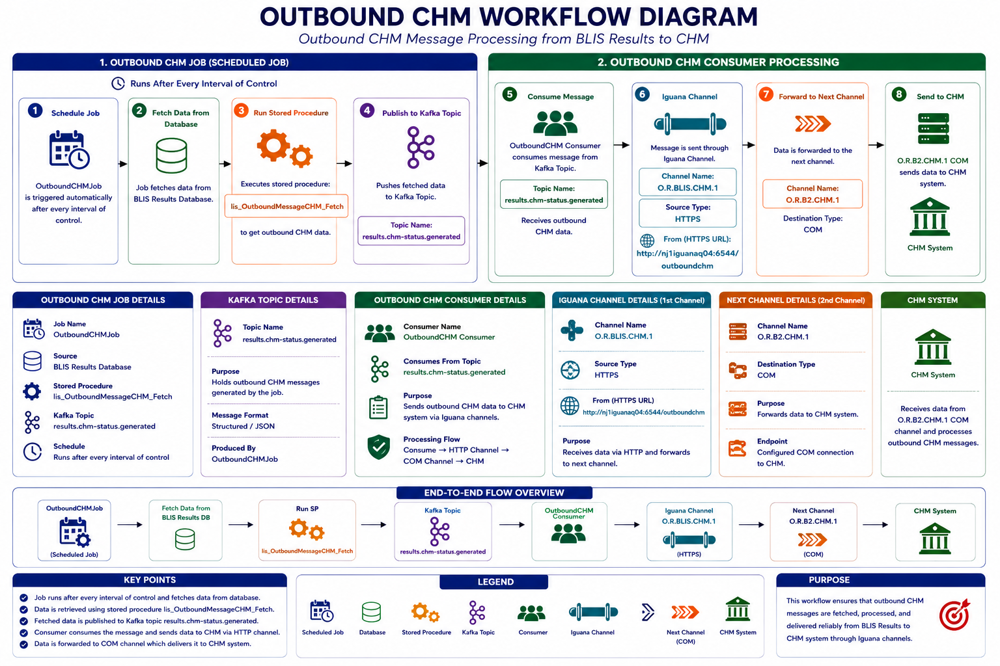

# Audit Workflow

## Overview

The **Audit Out Workflow** is responsible for fetching COC audit
records, publishing them to Kafka, and then saving the processed audit
data into the **AuditOut** table.

This workflow has two main parts:

1.  **AuditOut Job**

2.  **AuditOut Consumer**

## 1. AuditOut Job

The **AuditOut Job** runs on a scheduled time interval.

The job fetches audit data by calling:

CocAudits.Fetch()

Internally, this fetch process uses the stored procedure:

lis_CocAudits_Fetch

## 2. Fetch Audit Data

The stored procedure returns the COC audit records that need to be
processed.

AuditOutJob  
↓  
CocAudits.Fetch()  
↓  
SP: lis_CocAudits_Fetch  
↓  
Fetch COC Audit Data

## 3. Publish to Kafka Topic

After fetching the audit data, the **AuditOut Job** publishes the
message to Kafka topic:

result.audit-message.generated

## 4. AuditOut Consumer

The Kafka topic is consumed by:

AuditOutConsumer

The consumer reads the audit message from Kafka.

## 5. Save to AuditOut Table

After consuming the message, the **AuditOutConsumer**:

1.  Reads the Kafka message.

2.  Extracts all required audit fields.

3.  Maps the data into the AuditOut structure.

4.  Saves the record into the:

AuditOut

table.

## End-to-End Flow Summary

AuditOutJob  
↓  
CocAudits.Fetch()  
↓  
Stored Procedure:  
lis_CocAudits_Fetch  
↓  
Fetch COC Audit Records  
↓  
Publish to Kafka Topic  
result.audit-message.generated  
↓  
AuditOutConsumer  
↓  
Read Kafka Message  
↓  
Extract Audit Data  
↓  
Save into AuditOut Table

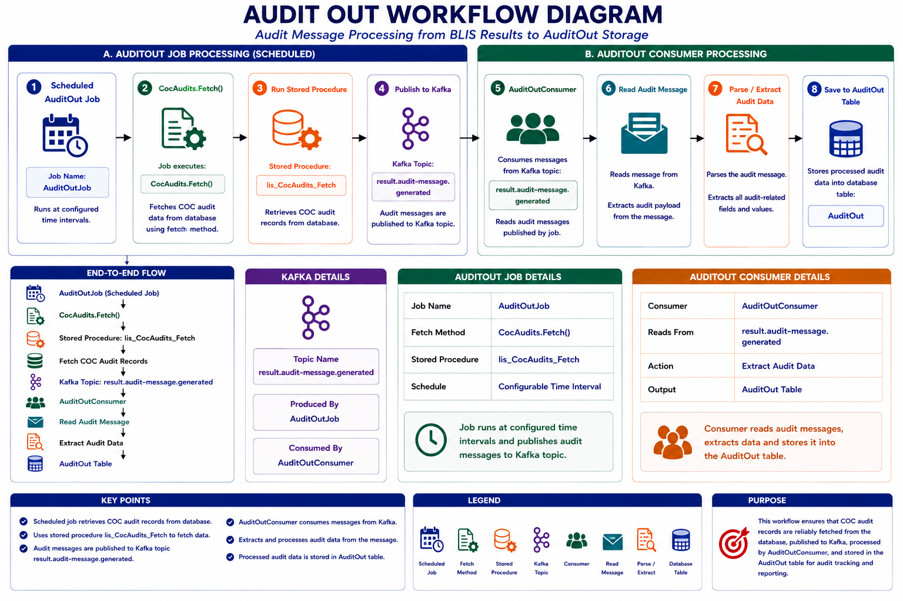

# Reflex Workflow

## Overview

The **Reflexes Workflow** is responsible for fetching outbound reflex
messages, publishing them to Kafka, and then calling ETS so Ordering can
send back the required order updates.

This workflow has two main parts:

1.  **Reflexes Job**

2.  **Reflexes Consumer**

## 1. Reflexes Job

The **Reflexes Job** runs at a configured time interval.

It calls:

OutboundMessages.Fetch

Internally, this uses the stored procedure:

lis_OutboundMessages_Fetch

## 2. Fetch Outbound Reflex Data

The stored procedure fetches the eligible outbound reflex messages from
the database.

ReflexesJob  
↓  
OutboundMessages.Fetch  
↓  
SP: lis_OutboundMessages_Fetch  
↓  
Fetch Reflex Data

## 3. Publish to Kafka

After fetching the data, the **Reflexes Job** publishes the message to
Kafka topic:

results.reflex.generated

This topic is consumed by the **Reflexes Consumer**.

## 4. Reflexes Consumer

The **Reflexes Consumer** listens to:

results.reflex.generated

It consumes the payload and extracts the accession number.

## 5. Fetch ETS URL from DB Settings

The consumer retrieves the ETS base URL from database settings:

dbSettings.BlisETSUrl

## 6. Build ETS Request URL

The consumer builds the ETS request using the accession number from the
Kafka payload.

string url =  
\$"{BlisETSUrl}" +  
\$"?callingApp=B2_REFLEXES" +  
\$"&userName=EntB2Reflexes" +  
\$"&AccessionNumber={Uri.EscapeDataString(accessionNumber)}";

## 7. Send Request to ETS

The consumer sends the request to ETS.

The request includes:

| **Parameter**   | **Value**                           |
|-----------------|-------------------------------------|
| callingApp      | B2_REFLEXES                         |
| userName        | EntB2Reflexes                       |
| AccessionNumber | Accession number from Kafka payload |

## 8. Ordering Sends Order Update

After ETS receives the request, Ordering processes it and sends back the
updated order data for that accession.

## End-to-End Flow Summary

ReflexesJob  
↓  
OutboundMessages.Fetch  
↓  
Stored Procedure:  
lis_OutboundMessages_Fetch  
↓  
Fetch Reflex Data  
↓  
Publish to Kafka Topic:  
results.reflex.generated  
↓  
ReflexesConsumer  
↓  
Consume Payload  
↓  
Extract AccessionNumber  
↓  
Fetch BlisETSUrl from DB Settings  
↓  
Build ETS URL  
↓  
Send Request to ETS  
↓  
Ordering Sends Updated Order Data

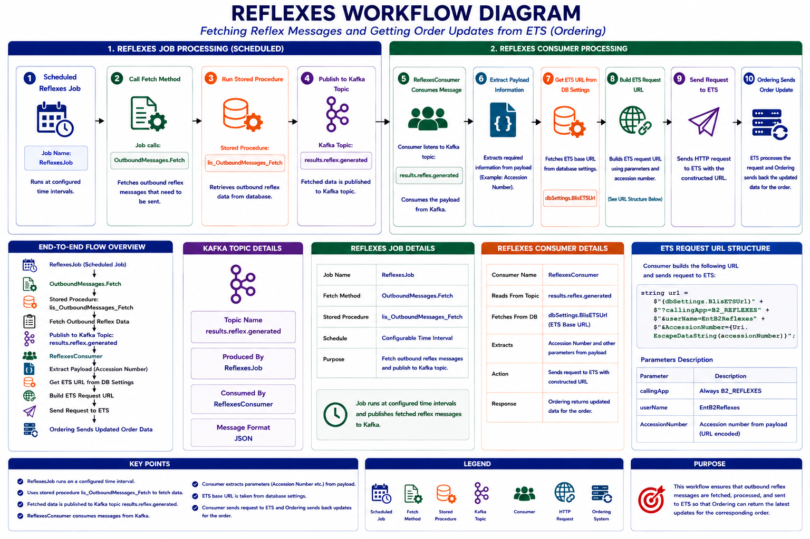

# Requisition Status Workflow

## Overview

The **Requisition Status Job** is a scheduled job that fetches POC
accession data, creates batches from the fetched records, and saves the
batch data back into the database.

## Workflow Description

### 1. RequisitionStatusJob Runs

The job runs after a configured time interval.

RequisitionStatusJob

### 2. Fetch POC Accession Data

The job executes the stored procedure:

lis_AllPOCAccessions_Fetch

This stored procedure fetches all eligible POC accession records.

### 3. Create Batches of Data

After the data is fetched, the job creates batches from the returned
records.

CreateBatchesOfData

### 4. Save Batch Data

After batches are created, the job saves the batch data into the
database.

SaveBatchData

## End-to-End Flow Summary

RequisitionStatusJob  
↓  
Run Stored Procedure  
lis_AllPOCAccessions_Fetch  
↓  
Fetch POC Accession Data  
↓  
CreateBatchesOfData  
↓  
SaveBatchData  
↓  
Batch Data Saved in Database

# Report Revision Workflow Document

## Overview

The **Report Revision Workflow** is responsible for notifying designated
users whenever an analyte result is corrected.

When a user changes an analyte result, the system presents a corrective
form on the front end. The user enters the reason for correcting the
analyte result. A scheduled job later retrieves the corrected analyte
information from the database and sends an email notification to the
configured recipients.

## Workflow Description

### **1. Analyte Result Is Corrected**

The workflow starts when an existing analyte result is changed or
corrected.

This may occur when:

- An incorrect result needs to be updated.

- Additional information becomes available.

- A previously released result requires correction.

- A correction is requested after review.

### **2. Corrective Form Is Displayed**

When the analyte result is changed, a corrective form is displayed on
the front end.

The form allows the user to enter information related to the correction.

The information may include:

- Corrected analyte

- Previous result

- Updated result

- Correction reason

- User performing the correction

- Correction date and time

- Additional comments

### **3. User Provides Correction Reason**

The user enters the reason for changing the analyte result.

The correction reason explains why the original result was modified.

The system stores the corrective information in the database along with
the corrected analyte details.

### **4. Report Revision Job Runs**

A scheduled job runs at a configured time interval.

ReportRevisionJob

The job checks the database for corrected analytes that are eligible for
notification.

### **5. Fetch Corrected Analyte Data**

The Report Revision Job retrieves corrected analyte records from the
database.

### **6. Retrieve Designated Email Recipients**

The job retrieves the designated email addresses from application or
database settings.

These email addresses identify the users or groups that must be notified
when a report revision occurs.

Configured Report Revision Email Recipients

### **7. Generate Revision Email**

The job creates an email containing the corrected analyte and report
information.

### **8. Send Email Notification**

The Report Revision Job sends the generated email to all configured
recipients.

The notification informs the designated users that an analyte result has
been corrected and that the related report may have been revised.
